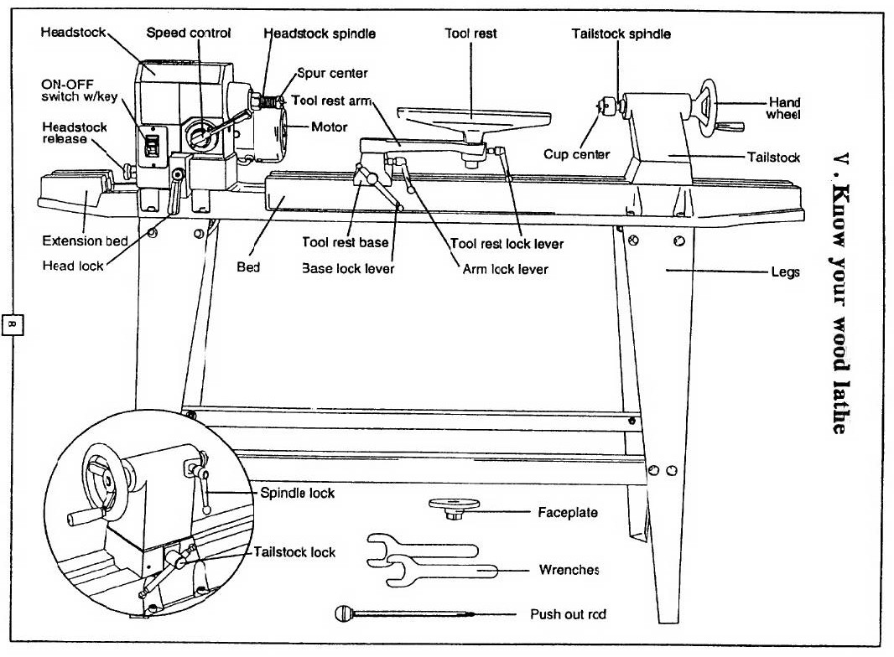
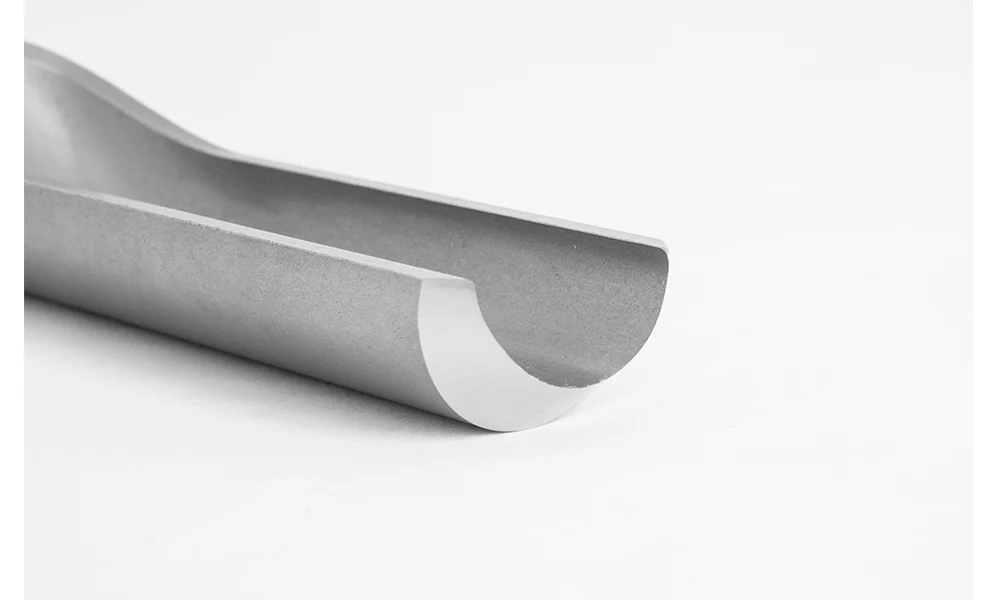
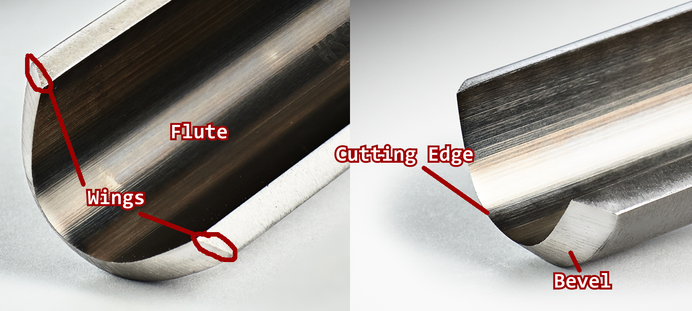
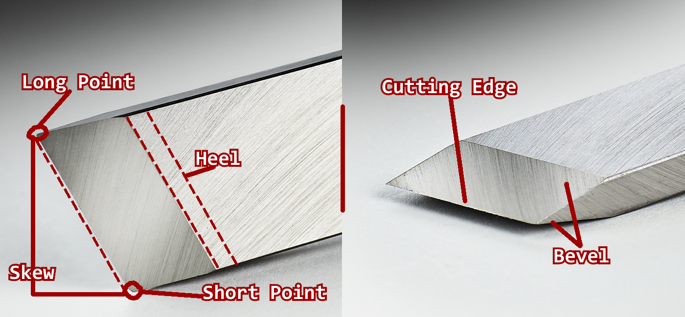
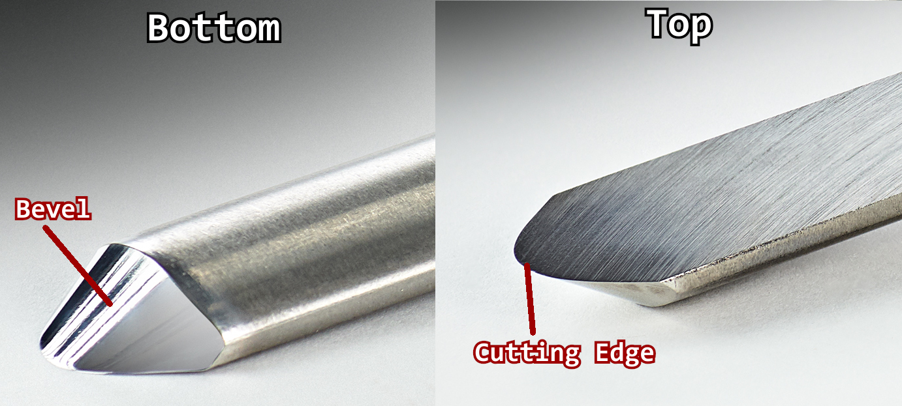

---
tags:
    - STUB
    - equipment
    - woodworking
---
# Central Machinery 12 x 36 Wood Lathe

## Current Status: Operational
  
### Maintenance Log
`20260622: expandable chuck jaws oiled; lathe cleaned`

## Pre-Usage Notes

!!! danger

    Users assume all risk associated with the use of tools and equipment in this facility.
    
!!! warning 

    - Eye protection is **REQUIRED**
    - Tool certification is **REQUIRED**
    - Tying back of long hair is **REQUIRED**
    - Tying back of straps, or other hanging pieces of clothing, is **HIGHLY RECOMMENDED**
    - Do not use loose clothing, specifically long sleeves, when operating this tool
    
!!! note

    - The lathe speed can only be adjusted one speed level while the lathe is turned off. Before mounting workpieces turn the lathe on and lower the speed for safety
    - Use of a dust mask, or respirator, is recommended
    - Bringing your own PPE is recommended

## Lathe Overview

 

## Chucks and Mounting Tools
### Expandable Chuck
- Under Construction

 

## Turning Tools

!!! note
    
    The sections below cover the very, very bare basics to get users started. Sizes of gouge tools will differ as manufacturers from Europe measure the inside flute distance, whereas Canadian and American manufacturers measure the bar stock.

### Gouges

#### Spindle Roughing Gouge

!!! tip

    Recommended as the first tool to use when learning woodturning.
    
##### Overview
Used for taking away a lot of material quickly, such as turning square stock into round. Not recommended for detail work or face work.

##### Usage and anatomy

<!-- WIP

    

-->

The flute of the gouge is a centered "U" shape. The roughing gouge can be used perpendicular to the workpiece, but this tool should generally be used at a slight angle to the workpiece. The bevel should touch the workpiece before the cutting edge. Try to stay away from the top corners of the "U" as this can cause a catch. Keep the leading edge, which is the edge that is lower during a cut, away from the wood. Your hand can be used as a depth stop on the tool and tool rest. Body movement is also important when trying to achieve a parallel cut, and you should used your hips and torso to follow your cut. When first roughing a piece, such as square stock, chips will be producing instead of shavings.

##### Tutorials
- [Richard Raffan on spindle-roughing gouges](https://youtu.be/rA0MaWollv4?si=Q3KUnN1_y9qy7LG1)
- [An important lesson with a Spindle Roughing Gouge](https://youtu.be/GJfb_v30voQ?si=HuT35EoCWsHvcoFk)

#### Spindle Gouge

!!! tip

    Recommended as the second tool to use when learning woodturning.
    
##### Overview
Sometimes also called a detail gouge, contour gouge, or fingernail gouge. Despite the lack of name standardization, this tool excels at long-grain turning. Long-grain turning is when the grain of the wood is mounted parallel to the bed, which many know as a "spindle". This tool is a great choice for cutting coves, beads, ogees, and other variations of convex and concave shapes. These traits make it ideal for detail work, but not for roughing work. These tools are much smaller than roughing gouges.

##### Usage and anatomy
Just like the [roughing gouge](#spindle-roughing-gouge), the spindle gouge is a "U" shape. The shape differs slightly as the flute is much more shallow. Before starting any cut, ensure the bevel of the spindle gouge is rubbing/touching the wood before starting a cut. This helps to prevent catches. Do not try forcing this tool through a cut. When cutting, keep one hand on the rest and the other towards the end of the handle. Keep your grip firm, but not tight. Smooth, continuous motions are what help this tool shine. 

##### Tutorials
- [Richard Raffan on the uses of a ½-in spindle gouge](https://youtu.be/WySx5rhyvfQ?si=QiqD9fzRfJ4Ii--W)
- [Mastering the Spindle Gouge - Basic Cuts & Practice Exercises](https://youtu.be/2B-VLkT5dAw?si=PYQJUcEmhkbncTyg)

### Chisels

#### Skew Chisel

!!! info

    This is not a beginner friendly tool. Watching a few tutorials before attempting is recommended. 

##### Overview
Very versatile tool that can perform V-cuts, parting cuts, planing cuts, and can also be used for smoothing. The cutting edge angle has a long point and a short point, thus the name "skew". Most skew chisels have a 40-45 bevel angle. It is also recommended to use this tool with the rest in a higher position than you would use for your gouge (slightly above center)

##### Usage and anatomy

There are four important cuts for mastery of this tool:

**The Peel Cut**

This is a roughing cut. It is used to remove large amounts of material, such as removing square corners. This cut can also be used to reduce the diameter of your workpiece quickly. To perform this cut the handle of the tool needs to start in a low position, and then arc into the wood. The goal is to bring the cutting edge towards the center and peel away wood. Lead with the long point with the cutting edge parallel to the workpiece. Never enter a cut straight on. 

**The V-Cut**

This is a useful cut for defining features and transitions, and for cleaning up end grain. This is also an arcing cut. The long point should be facing downwards closest to the tool rest. The bevel should face into the direction you want to cut. When taking cuts work a little each time alternating between sides of the V. 

**The Planing Cut**

This cut is great for achieving a great surface finish, that when done correctly, doesn't require sanding. This is a bevel riding cut. Slowly raise the handle until the cutting edge enages at approximately 45 degrees to the wood. The cutting edge should favor the short point. Advance the tool across the tool rest maintaining cosistent pressure. 

**The Scrape**

This cut is used for refining curves. Lay the tool flat on the rest and engage the wood using the approximate center of the cutting edge. Lightly traverse across the surface. It is important to note that this cut does have a tendency to dull the cutting edge faster.

##### Tutorials

- [Richard Raffan on skew chisel basics](https://youtu.be/Px7xiuXeNvc?si=ACJN4tSLQXoqf_0Y)
- [Taming the Beast: The Complete Guide to Mastering Your Skew Chisel](https://youtu.be/-SxFXT2WXhM?si=bpOsbacEW9GT02RW)

#### Sorby Spindlemaster

!!! info

    This is not a beginner friendly tool. Watching a few tutorials before attempting is recommended. 

##### Overview
Ideal for rolling beads or cutting coves. Top face of the tool is honed flat, and the bevel is a smooth half-circle. It can behave as both a scraping and cutting tool. A more specialized alternative to a skew chisel. Do not cut with the tip of the tool, as this is an unsupported edge. 

##### Usage and anatomy

<!-- I'll mess with this later -Ryan

-->

##### Tutorials
- [A video guide to the Robert Sorby Spindlemaster](https://youtu.be/EVZUAsI7rx0?si=rss_dV0SuoPzikkJ)
- [The Robert Sorby Spindlemaster - An easy to use alternative for the regular skew chisel](https://youtu.be/0Xd1rd_DGR0?si=XkeDza6JdUwK7_We)

#### Parting Tool

!!! tip

    This is a beginner friendly tool.
    
##### Overview
This tool is used to square up ends of a spindles, cut tenons, separate parts from a spindle (such as supports), or for adding decorative accoutrements.

##### Usage and anatomy
Placeholder

##### Tutorials
- [P]()
- [P]()

 

## Sharpening Tools
