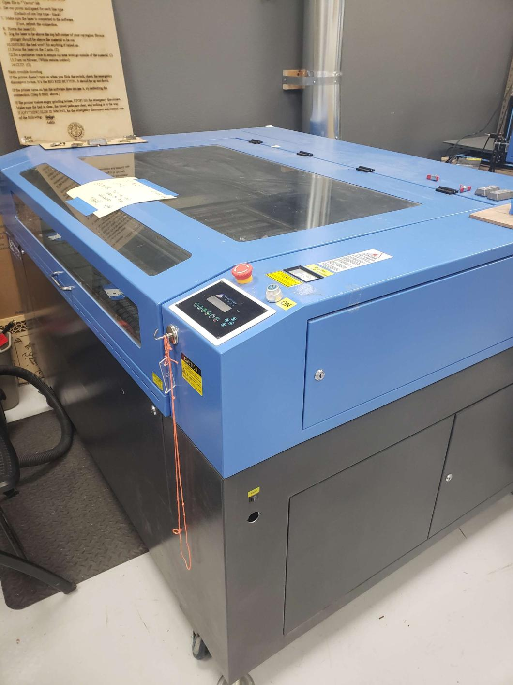
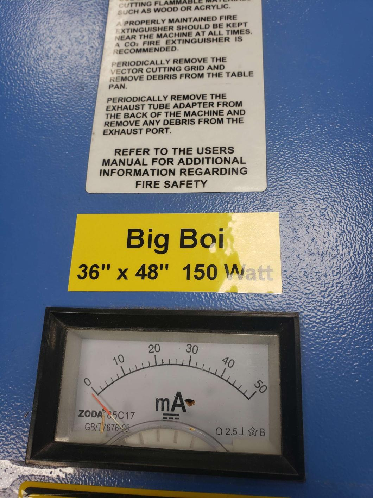

---
tags:
    - STUB
    - equipment
    - laser cutter
---
# "Big Boi"  Laser Cutter

* The shop's largest laser cutter, thus it is called "Big Boi"
* 150 Watt Pro LF Series 48" x 36" CO2
* Uses [Retina Engrave](../Software/Retina Engrave)
* See also ["First Child"](../Equipment/Laser Cutting/First Child Laser Cutter) and ["New Kid"](../Equipment/Laser Cutting/New Kid Laser Cutter) laser cutters

## Current Status

- **Functional** - Laser cutter can be used by members
- **Remaining Issues:** Red alignment dot not super visible across most of the cutting area.
  
### Maintenance Log
**2023-11-29 - Rebuilt Power Switch Key assembly** - Nuke Mike

- Discovered one leg of the power circuit was loose
- Discovered one side of the dual switch was broken
- Reconnected circuit
- Switched key switch to the other side of the switch assembly, which is new/untouched.
- Reassembled switch assembly in laser cutter
- Still no go; but key was tested to work correctly. Issue has now been traced to the ground-fault box.

**2023-11-29 - Blown fuse replaced** - Nuke Mike

- Digging further down the power train, found a fuse that was blown.
- The power plug had a spare fuse, so we replaced with that. 
- Big Boi now up and running. NukeMike will pick up a replacement fuse tomorrow and put it back into the spare fuse spot.
