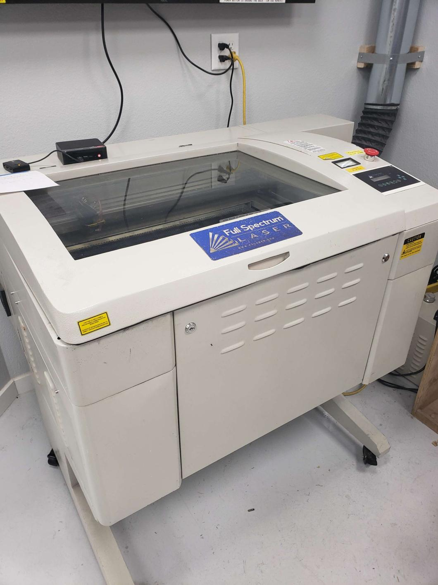
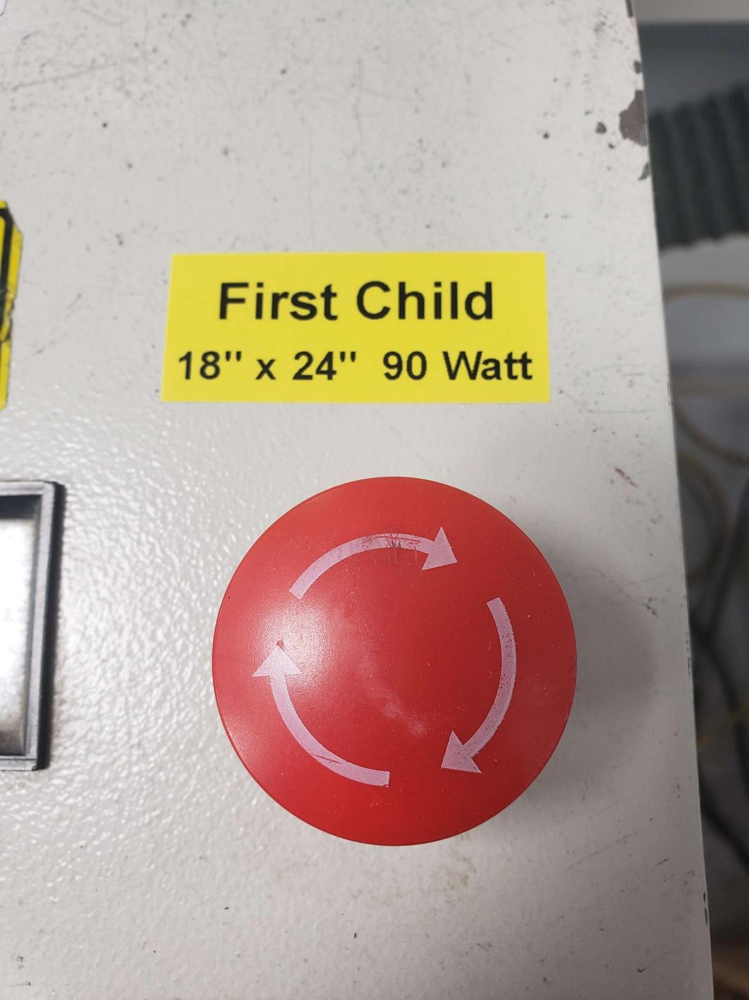

---
tags:
    - equipment
    - laser cutter
---
# "First Child"  Laser Cutter

The shop's first laser cutter, thus it is called "First Child"
## Laser:
90 Watt Pro LF Series 24" x 18" CO2
## Software:
### Lightburn
[Quick Start Guide](../../Software/Lightburn Quick Guide.md)  
[Quick Start Video](https://youtu.be/82tKnldgrEM)
[Lightburn 2.0 Manual](https://lightburnsoftware.github.io/DocsResources/PDF/LB/LightBurn2.0.pdf)
  
## Key Features:

## Current Status

- **Operational**

   * See also ["Big Boi"](../Big Boi Laser Cutter) and ["New Kid"](../New Kid Laser Cutter) laser cutters

### Maintenance Log
