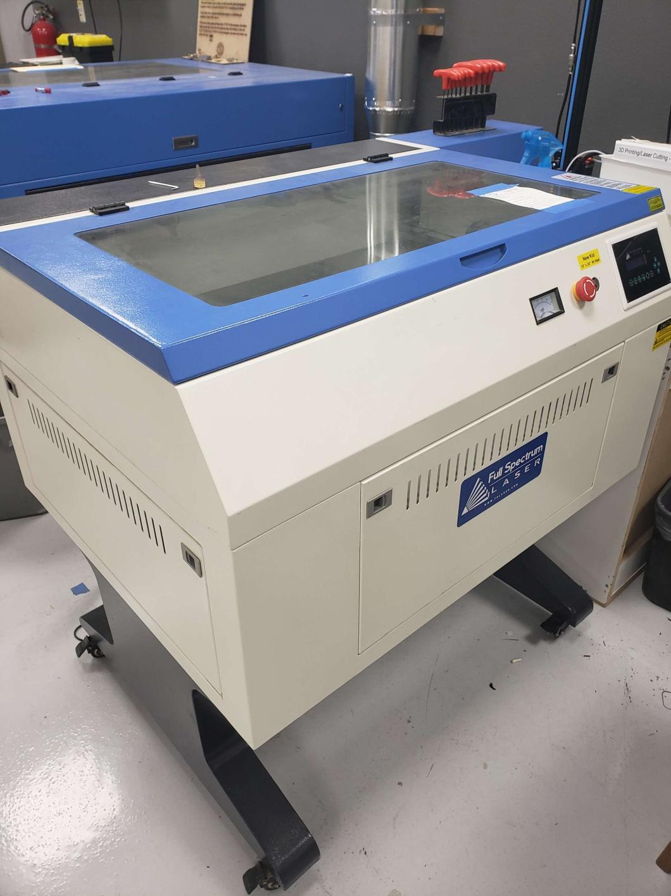

---
tags:
    - equipment
    - laser etcher
---
# "New Kid"  Laser Etcher

* The shop's newest laser engraver, thus it is called "New Kid"
* ###Laser Module:
    * Sculpfun IR-2 1064nm 2 Watt Infrared
###Software:
* Lightburn
   * [Quick Start Guide](../../Software/Lightburn Quick Guide.md)
   * [Lightburn 2.0 Manual](https://lightburnsoftware.github.io/DocsResources/PDF/LB/LightBurn2.0.pdf)
  
* ### 🔧 Key Features

- **Engravable Materials**: Gold, silver, platinum, copper, aluminum, zinc, iron, stainless steel, metal oxides and alloys, plastics, and dark acrylics.
- **High Precision**: Ultra-fine 0.03mm laser spot  
- **Pulse Energy**: 20,000Hz

* Uses 
* See also ["Big Boi"](../Big Boi Laser Cutter) and ["First Child"](../First Child Laser Cutter) laser cutters

## Current Status

- **Operational**
  
### Maintenance Log
