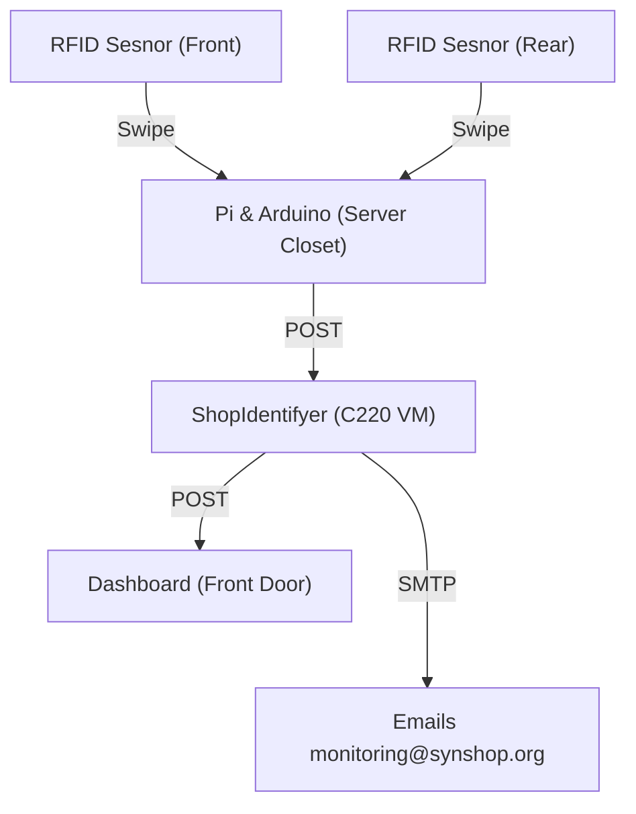

# Access Control System

## Overview

An access control system for SYN Shop that handles RFID access to the shop front and rear doors.  It uses the following:

* [Open Access 3.0](https://www.accxproducts.com/wiki/index.php?title=Open_Access_3.0) - Runs on an Arduino that works autonomously of any network connection or raspberry pi, only needs power. Has battery backup. 
* [log-alerter](https://github.com/synshop/log-alerter) - Runs on Raspberry Pi connected to Arduino over serial.  Monitors serial output via `minicom`  into `access_log.txt` and then writes to `user_access_log.txt`. Sends HTTP `POST`s to ShopIdentifyer of swipe activity (approved or denied swipes with timestamp).
* [ShopIdentifyer](https://github.com/synshop/ShopIdentifyer) - Runs on a VM on the server at the shop.  Has integrations with Stripe to detect membership status based off Fob <-> Stripe ID lookups.



For info on how to build the hardware, see [Access Control System bill of materials](https://docs.google.com/spreadsheet/ccc?key=0As-Fbiasxp7CdC1ZWXZZVzRoRzdycnZjV19ZVW5WMFE#gid=2)

##  `screen` and `minicom`

The Raspberry Pi runs `screen` with the `access` account to talk over the serial port (usb <-> serial) with `minicom`. Let's break that down:

* `screen` - an app that [allows you to connect](https://en.wikipedia.org/wiki/GNU_Screen) to a long lived terminal. 
* `minicom` - a terminal emulator that [allows you to talk to serial devices](https://en.wikipedia.org/wiki/Minicom) like the Open Access v3 MEGA, Kit
* `access` - a user account on the Raspberry Pi where we run both `screen` and `minicom`

Given that the `screen` session is persistent, you need to always `su` to the `access` user.  Then you need to connect
to the existing screen session with `screen -r minicom`.

**NOTE:** - When you're done with `screen` type `ctrl + a` then `d`.  This will detach from the session, but
keep it running.

If you're concerned you messed something up, just run `sudo reboot` to reboot the whole Pi, and it should all be fixed.

### Help Text from Open Access 3.0

These are all the options you can use when you're in a `minicom` session connected to the Open Access system on the Arduino:
    
    Valid commands are:
    (d)ate, (s)show user, (m)odify user <num>  <usermask> <tagnumber>
    (a)ll user dump,(r)emove_user <num>,(o)open door <num>
    (u)nlock all doors,(l)lock all doors
    (1)disarm_alarm, (2)arm_alarm,(3)train_alarm (9)show_status
    (t)ime set <sec 0..59> <min 0..59> <hour 0..23> <day of week 1..7>
    <day 0..31> <mon 0..12> <year 0.99>
    (e)nable <password> - enable or disable priveleged mode
    (h)ardware test - Test the hardware
    


## Adding New Vetted Members

### Raspberry Pi
0. SSH into badger (name of Pi) at `10.0.40.10` and `su - access`. You need to use your personal account, not the `access` account to SSH.
1. Run  `tail /home/access/logs_and_users/user_access_log.txt` on badger and wipe the unprovisioned badge at a reader
3. Get the Hex and Decimal ID by looking for `DENIED rando badge` in your `tail` command. The hex is `BAC351` and the decimal is `127077` in this line:

    `"8:45:42","7/28/23","DENIED rando badge","BAC351","127077","0","na","","2"`

4. cancel out of the `tail` command (ctrl + c) and run `screen -r minicom`
5. Enter into enable mode with `e`. The password is in Systems keepass under "Access Control RaspberryPi SSH (electric-badger)":

    ```
    e [enable_password]
    18:56:22  9/10/19 TUE Priveleged mode enabled.
    ```
   
6. add the user by using the `m` command followed by the user ID, access level (always `254`) and decimal badge number:

    ```
    m 3 254 1811700
    19:10:21  9/10/19 TUE User 7 successfully modified
    3      254     1811700
    ```
7. Type `ctrl + a` then `d` to detach from screen.
8. Test that the badge works.

### ShopIdentifyer

Steps TBD

## Revoking Vetted Members

### Raspberry Pi
0. SSH into badger (name of Pi) at `10.0.40.10` and `su - access`. You need to use your personal account, not the `access` account to SSH. 
1. Run `screen -r minicom`
2. Type `a` to show a list of all users.  Find the user you want and get the ID on the left of the line (eg `99`)
3. Remove the user with the `r` command followed by the user ID. User ID is the line from above:

    r 99
    99 99     255     FFFFFFFF
    19:17:41  9/10/19 TUE User deleted at position 99
4. When you're done with `screen` type `ctrl + a` then `d` to detach from screen.

### ShopIdentifyer

Steps TBD

## About Decimal vs Hexadecimal for badges

The badge reader doesn't give us the full RFID, it rather reads the last 31 bits and a parity bit

```
proxmark3> lf search
NOTE: some demods output possible binary
  if it finds something that looks like a tag
False Positives ARE possible

Checking for known tags:

EM410x pattern found:

EM TAG ID      : 38001BA4F4

Possible de-scramble patterns
Unique TAG ID  : 1C00D8252F
HoneyWell IdentKey 
    DEZ 8          : 01811700
    DEZ 10         : 0001811700
    DEZ 5.5        : 00027.42228
    DEZ 3.5A       : 056.42228
    DEZ 3.5B       : 000.42228
    DEZ 3.5C       : 027.42228
    DEZ 14/IK2     : 00240519980276
    DEZ 15/IK3     : 000120273249583
    DEZ 20/ZK      : 01120000130802050215

Other          : 42228_027_01811700
Pattern Paxton : 942662388 [0x382FE2F4]
Pattern 1      : 5126429 [0x4E391D]
Pattern Sebury : 42228 27 1811700  [0xA4F4 0x1B 0x1BA4F4]

Valid EM410x ID Found!

38001BA4F4 = 00111000 00000000 00011011 10100100 11110100
```

Based on that we can calcuate the tag number read by the reader:

```
 discarded  tag number
[001110000][0000000000110111010010011110100][parity]
            0000000000110111010010011110100  1
```

If even number of bits in tag number parity is `1`, otherwise parity is `0`

```
00000000 00110111 01001001 11101001 = 003749e9
```

All leading zeros are discarded

So our tag number is `3749e9`
