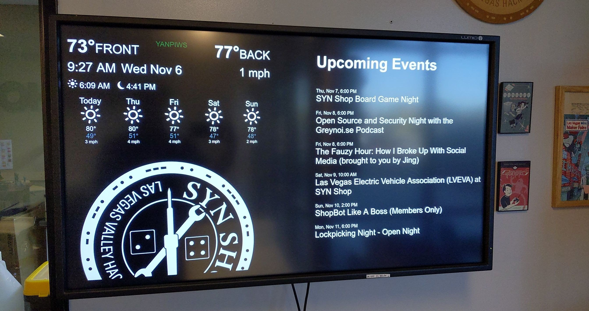

# Front Kiosk Display 

How to build this:

## Bill of Materials

  * Big ass wall mounted TV with HDMI in
  * Raspberry Pi or other small computer with HDMI out and I2C pins

So what is all this stuff and how does it work?!  The large top display
is simply a TV.  This one happens to be an industrial one normally used in a 
commercial setting.  Unlike a TV you might have at home, it has no tuner
built in to it, so only works with HDMI inputs like you might have on your
DVD player or streaming device (eg Roku).

The device below is where all the magic happens though.  This is a
[Raspberry Pi computer](https://en.wikipedia.org/wiki/Raspberry_Pi).  While
tiny, it has the ability to power the larger monitor using HDMI.  As well, 
it has a WiFi radio so it can get on our shop network and out to the internet.
As well, it has  
[General purpose input-output (GPIO)](https://en.wikipedia.org/wiki/Raspberry_Pi#General_purpose_input-output_(GPIO)_connector) 
connectors so it can power things like the very small display as well as the
temperature sensor.

If you want to build your own version of these, all the software is online 
and open source:

  * Forecast and temperature software is called [YANPIWS](https://github.com/Ths2-9Y-LqJt6/YANPIWS).
  * The display of upcoming events is from our MeetUp page and is displayed
    using [this gist](https://gist.github.com/Ths2-9Y-LqJt6/b588352f29b46af639c09891eaee13d2).
  * The spinning shop logo is just an SVG and you can download it from 
    [this wiki](/users/Logos/). To read more about CSS animations, 
    check out [getflywheel's site](https://getflywheel.com/layout/svg-animations-css-how-to/ )!
    
 If you're a shop administrator looking to rebuild this system in case it crashed or something,
 check out the [admin page](/admins/kiosk/) on it.