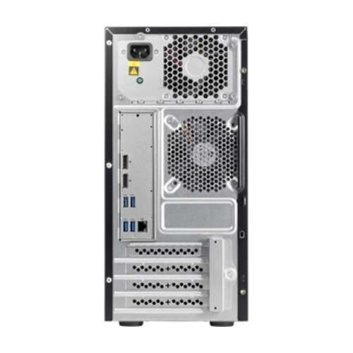
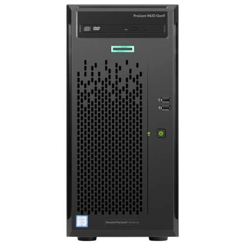

# media

media is a server hosted at the shop that houses drives which are then 
shared via ftp, http and rsync. If you're a user and just want to browse
or download files, please see [the user section](/users/media/).

## Hardware specs

This was orignally purchsed from TiderDirect and it's title is 
"HPE ProLiant ML10 Gen9 Tower Server - Intel i3-6100 Dual-Core 3.7GHz Processor, 4GB DDR4 Memory, DVD-RW, No OS,
Gigabit Ethernet, USB 3.0 - 866965-S01". Otherwise, specs are:

  * [Intel 6100 Dual Core i3 3.7GHz](https://ark.intel.com/content/www/us/en/ark/products/90729/intel-core-i3-6100-processor-3m-cache-3-70-ghz.html)
  * 4GB DDR4 (4 slots, 64GB max)
  * SATA with  RAID Levels	0,1,5,10
  * Up to 5 SATA Drives Supported 5
  * 15.8" x 6.9" x 14.5"
  
See [detailed PDF](./images/proliant.ML10.pdf) as well.
  


  
## OS

Media runs a vanilla install of Ubuntu 19.04. Give it the static IP of 10.0.40.19 (gateway 10.0.40.1, subnet 255.255.255.0, 
dns 10.0.40.66) and make sure
that the pi hole has an entry in it's /etc/hosts file so that it resolve locally in the shop.

## Drives

There are currently 4 drives: a boot and three data drives. The data drives all mount to /var/ftp/pub thusly:

```bash
ubuntu@files:~$ grep -v \# /etc/fstab
UUID=0c6017b8-2df7-4dfa-bfb3-0ce05ac07695 /               ext4    errors=remount-ro 0       1
UUID=2550-3646  /boot/efi       vfat    umask=0077      0       1
/swapfile       none            swap    sw              0       0
/dev/sdc2       /var/ftp/pub/infocon.org        ntfs    ro      0       0
/dev/sdd2       /var/ftp/pub/tables1-2  ntfs    ro      0       0
/dev/sdb2       /var/ftp/pub/tables2-2  ntfs    ro      0       0
``` 
 
## Apache

Apache is installed (`sudo install apache2`) and then the default vhost is edited to point to 
`/var/ftp` and browsing is enabled:

```bash
grep -v \# /etc/apache2/sites-enabled/000-default.conf 
<VirtualHost *:80>
        ServerAdmin webmaster@localhost
        DocumentRoot /var/ftp
        ErrorLog ${APACHE_LOG_DIR}/error.log
        CustomLog ${APACHE_LOG_DIR}/access.log combined

        <Directory "/var/ftp">
            Options Indexes MultiViews
            AllowOverride None
            Require all granted
        </Directory>

</VirtualHost>
```

## FTP

TBD - Muffins to put a sentance or three about set up here ;)

## rssh chrooted setup

rssh allows for just rsync/scp/sftp access with out letting the user log in with SSH.

To set rssh up, first make sure that prereqs are 
installed (`apt-get install openssh-server openssh-sftp-server ssh-import-id ncurses-term`) and then 
 install `rssh` directly from [this pacakage](/images/rssh_2.3.4-7ubuntu0.1_amd64.deb.zip) 
 (`dpkg -i rssh_2.3.4-7ubuntu0.1_amd64.deb`). The reason for 
this is 19.04, at the time of publishing, didn't have the `rssh` package in it's repos, so we 
add it manually via `dpkg`

Add a media user (`useradd media`) and specify a password of media. Then set their shell to be `rssh` in `/etc/passwd`.  Note User ID (1001)
 may differ, that's unimportant:

```bash
media:x:1001:1001:,,,:/home/media:/usr/bin/rssh
```

Remove `/home/media` and make it a symlink to the FTP dir (`ln -s /var/ftp /home/media`). 

Finally, update the `/etc/rssh.conf` to allow scp, sftp, rsync and enable the media user:

```bash
grep -v \# /etc/rssh.conf 
logfacility = LOG_USER 
allowscp
allowsftp
allowrsync
umask = 022
user=media:022:100110:
```