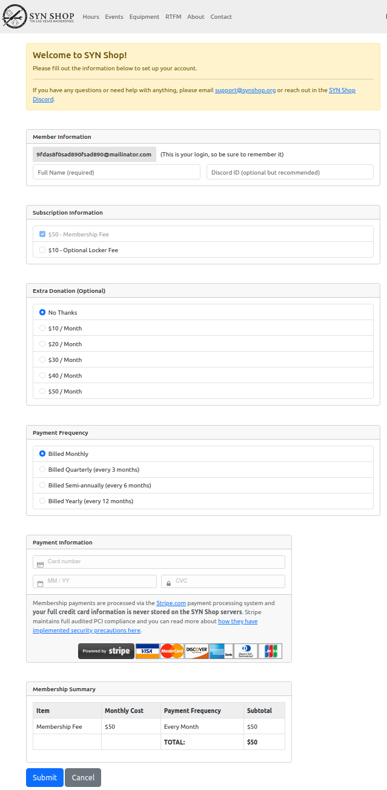

# membership website

## Intro

Membership is hosted at both membership.synshop.org and membership-dev.synshop.org on new-lagos.synshop.org.  It's a python flask app and has a [GH Repo](https://github.com/synshop/membership.synshop.org).

## One time setup

1. create DNS entries to server. "server" in this case on lagos-new so `membership.synshop.org` and `membership-dev.synshop.org` both have a `CNAME` for `lagos-new.synshop.org.` See [Caddy page](https://rtfm.synshop.org/admins/Caddy%20and%20TLS%20certs/#first-time-cert-generation-w-dns-update) which talks about making new DNS entries.
2. on server, install pre-reqs:
   
        apt install python3 python3.10-venv certbot debian-keyring debian-archive-keyring apt-transport-https gunicorn
   
3. install `caddy` key, repo and binary:

        curl -1sLf 'https://dl.cloudsmith.io/public/caddy/stable/gpg.key' | sudo gpg --dearmor -o /usr/share/keyrings/caddy-stable-archive-keyring.gpg
        curl -1sLf 'https://dl.cloudsmith.io/public/caddy/stable/debian.deb.txt' | sudo tee /etc/apt/sources.list.d/caddy-stable.list
        sudo apt update
        sudo apt install caddy
        systemctl start caddy
        systemctl enable caddy

4. edit `/etc/caddy/Caddyfile` and put in this contents at the bottom:

        membership.synshop.org {
           reverse_proxy localhost:3000
        }
        membership-dev.synshop.org {
           reverse_proxy localhost:4000
        }

5. restart caddy: `systemctl restart caddy`. These two URLs should now work but have not content: [membership](https://membership.synshop.org/) and [membership-dev](https://membership-dev.synshop.org/)
6. create new `membership` user on server
7. create new ed25519 ssh key WITHOUT a password for `membership` on server
8. add the newly created public SSH key to the [Deploy Keys](https://github.com/synshop/membership.synshop.org/settings/keys/new) for Membership GitHub Repo. Ensure it is read only when adding it.
9. as `membership` user, clone the repo twice. You shouldn't be prompted for authentication because of the deploy key step above:

        git git@github.com:synshop/membership.synshop.org.git /home/membership/membership.synshop.org
        git git@github.com:synshop/membership.synshop.org.git /home/membership/membership-dev.synshop.org
   
10. as `membership` user, create a virtualenv for each install:

        cd /home/membership/membership.synshop.org
        python3 -m venv venv;. venv/bin/activate
        deactivate
        cd /home/membership/membership-dev.synshop.org
        python3 -m venv venv;. venv/bin/activate
        deactivate
   
11. as `membership` user, ensure each repo is on the correct branch:

        cd /home/membership/membership.synshop.org
        git fetch
        git checkout membership.synshop.net
        cd /home/membership/membership-dev.synshop.org
        git fetch
        git checkout membership-dev.synshop.org
   
12. In both repos, ensure we've installed the python pre-reqs:

        cd /home/membership/membership.synshop.org
        . venv/bin/activate
        pip3 install -r requirements.txt 
        cd /home/membership/membership-dev.synshop.org
        deactivate
        . venv/bin/activate
        pip3 install -r requirements.txt 
        deactivate

13. In each repo, create a new config file:

        cp /home/membership/membership.synshop.org/config.py.default /home/membership/membership.synshop.org/config.py
        cp /home/membership/membership-dev.synshop.org/config.py.default /home/membership/membership-dev.synshop.org/config.py

14. Edit the 2 newly created `config.py` files to have correct values. See note below about Encrypted values.
15. Copy over two instances `service/membership.service` and `service/membership-dev.service` both to `/etc/systemd/system`
16. Edit the the two files in `/etc/systemd/system`  to have the right value for `ENCRYPTION_KEY`.  
17. Reload systemd and start and enable the services: `systemctl start membership;systemctl start membership-dev;systemctl enable membership;systemctl enable membership-dev`
18. Reboot server to make sure two services come up

### Encrypted values

Please note that all of the properties starting with `ENCRYPTED_` are encrypted.  When the application starts up, it will prompt you for a single decryption password.  This is the same password that you will use to encrypt the properties using the cli tool `./crypto/encrypt` and `./crypto/decrypt`.

In order for the decryption to work, you need to use the same password to encrypt all of the 6 values. Here's an example of encrypting the string `foo` with the password of also `foo`:

    python3 ./crypto/encrypt
    Please enter the encryption key:
    Please enter the plaintext you wish to encrypt:
    Encrypted Value: aSy9t6N2sxEDN+WzPyXKVA==

So, if you wanted `foo` to be the value for the `ENCRYPTED_DATABASE_PASSWORD` you would define it like this in `config.py`:

    ENCRYPTED_DATABASE_PASSWORD = 'aSy9t6N2sxEDN+WzPyXKVA=='

If you need to decrypt, it's the same process, but in reverse:

    python3 ./crypto/decrypt
    Please enter the decryption key: 
    Please enter the ciphertext you wish to decrypt: 
    Plaintext Value: foo

Again, you need to use the same password for each of the 6 encrypted strings in your config file.

## Pushing new content live

1. SSH to new-lagos
1. switch user to `membership` user: `sudo su - memberhsip`
1. cd into dev or prod: `cd membership.synshop.org` or `cd membership-dev.synshop.org`
1. pull in the latest code: `git pull origin`
1. restart the server: `systemctl restart membership` or `systemctl restart membership-dev`

## Development

TBD
