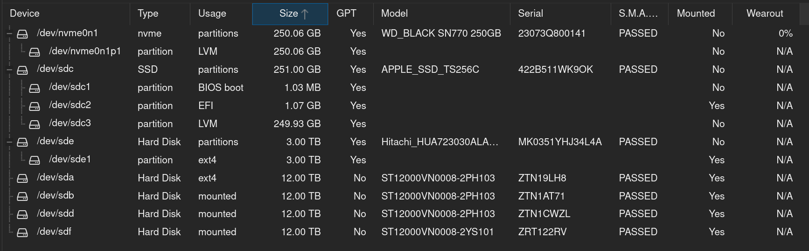
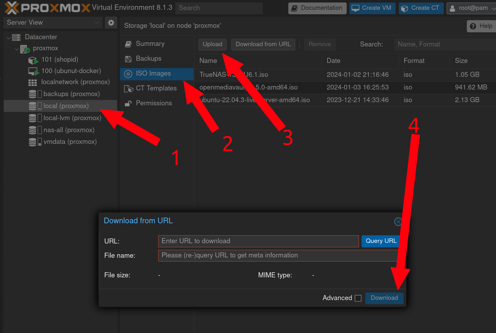

# Proxmox

## Overview

A desktop tower with [Proxmox](https://www.proxmox.com/en/) installed on it was deployed to: 

* Be a future home for all LXD containers on the c220 so the c220 can eventually be retired
* Host future projects that need a VM at the shop
* Host 4 x 12TB drives to serve media to the shop LAN

All Proxmox admin is done through the web GUI at [https://proxmox.synshop.net](https://proxmox.synshop.net), which is reverse proxied through the Caddy server to have a valid TLS cert.  The baremetal IP is `10.0.40.16`, but of course the proxmox.synshop.net domain resolves to Caddy at `.29`.

To log into the server, be on the VPN or at the shop, go the [URL](https://proxmox.synshop.net) and use the `proxmox` credentials from the shop password database.

## Install & Hardware

Proxmox was installed with these 7 drives:

* 256GB Apple branded 2.5" SATA SSD: boot drive for prox mox (`/dev/sdc`) . Shows as `local-lvm` or `pve` in Proxmox
* 256GB NVMe SSD: data volume for all active VMS (`/dev/nvme0n1`). Shows as `local` or `vmdata` in Proxmox.
* 3TB SATA: Backup drive for all Proxmox data, VMs etc. (`/dev/sde`). Shows as `backups` in Proxmox.
* 4 x 12TB SATA: TBD use for NAS/Media sharing (`/dev/sda`, `/dev/sdb`, `/dev/sdd` and `/dev/sdf` ). 

Here's the output of `lsblk`:

```shell
root@proxmox:~# lsblk
NAME                        MAJ:MIN RM   SIZE RO TYPE MOUNTPOINTS
sda                           8:0    0  10.9T  0 disk /mnt/nas/ZTN19LH8
sdb                           8:16   0  10.9T  0 disk /mnt/nas/ZTN1AT71
sdc                           8:32   0 233.8G  0 disk 
├─sdc1                        8:33   0  1007K  0 part 
├─sdc2                        8:34   0     1G  0 part /boot/efi
└─sdc3                        8:35   0 232.8G  0 part 
  ├─pve-swap                252:0    0     8G  0 lvm  [SWAP]
  ├─pve-root                252:1    0  68.2G  0 lvm  /
  ├─pve-data_tmeta          252:2    0   1.4G  0 lvm  
  │ └─pve-data-tpool        252:6    0 137.8G  0 lvm  
  │   ├─pve-data            252:7    0 137.8G  1 lvm  
  │   └─pve-vz              252:8    0   230G  0 lvm  /mnt/nvme
  └─pve-data_tdata          252:3    0 137.8G  0 lvm  
    └─pve-data-tpool        252:6    0 137.8G  0 lvm  
      ├─pve-data            252:7    0 137.8G  1 lvm  
      └─pve-vz              252:8    0   230G  0 lvm  /mnt/nvme
sdd                           8:48   0  10.9T  0 disk /mnt/nas/ZTN1CWZL
sde                           8:64   1   2.7T  0 disk 
└─sde1                        8:65   1   2.7T  0 part /mnt/pve/backups
sdf                           8:80   1  10.9T  0 disk /mnt/nas/ZRT122RV
nvme0n1                     259:0    0 232.9G  0 disk 
└─nvme0n1p1                 259:1    0 232.9G  0 part 
  ├─vmdata-vm--100--disk--0 252:4    0    32G  0 lvm  
  └─vmdata-vm--101--disk--0 252:5    0    30G  0 lvm  
```

Within Proxmox, you can see the drives this way:




## Downloading a new ISO 

To add a new  ISO so that you can create a VM with it later:

1. Navigate to `local` storage on left
2. Click `ISO Images` in middle
3. click `Upload` button at top
4. Enter ISO URL and click `Download`




## Creating a new container

1. On the left, Click "Datacenter" and then "Proxmox"
2. In the upper right click "Create CT"
3. On the `General` screen fill out `hostname`, `password` and `confirm password`. Add your own `SSH Public key(s)` and then leave the rest default. **Note** - by default containers won't allow yout to SSH with a password, only SSHs keys
5. Click `Next`
6. On the `Template` screen,  for `Storage` choose `local` and choose `Ubuntu` from the  `Template` drop down.
7.  Click `Next`
6. On the `Disks` screen,  for `Storage` choose `vmdata` and choose `30`  for  `Disk size (GiB)`.  leave the rest default.
7.  Click `Next`
8.  On the `CPU` screen,  for `Cores` choose `2` and  leave the rest default.
9.  Click `Next`
10.  On the `Memory` screen,  for `Memory` choose `2048` and  leave the rest default.
11.  Click `Next`
12.  On the `Network` screen,  for `IPv4/CIDR` choose an avail static IP.  For `Gateway` enter `10.0.40.1`  and  leave the rest default.
13.  Click `Next`
14.  On the `DNS` screen,  for `DNS Servers` enter enter `10.0.40.66`
15.  Click `Next`
16.  On the final `Confirm` screen choose `Start after created` and click `Finish`
17.  After the container is created choose it from the list on the right, click on `Options` and double click `Start at boot` to be checked

## Creating a new VM

1. On the left, Click "Datacenter" and then "Proxmox"
2. In the upper right click "Create VM"
3. On the `General` screen leave `Node` and `VM ID` with the default value.  Enter a descriptive, but short name in `Name`.
4. Check the `Advanced` check box near the bottom and check `Start at boot` box to ensure the VM is booted when ever the system reboots.
5. Click `Next`
6. On the `OS` screen, if you're installing from an ISO,  for `Storage` choose `local` and choose the ISO in the `ISO image` drop down.
7. Leave all other fields with default values and click `Next`
8. On the `System` screen, leave all fields with default values and click `Next`
9. On the `Disks` screen, choose `vmdata` for `Storage` which uses the "256GB NVMe SSD" device for very fast data.
10. If you need more or less storage than `32`, update the `Disk Size (GiB)` as needed.
11. Leave all other fields with default values and click `Next`
12. On the `CPU` screen, choose `2` for `cores` and leave all the rest default and click `Next`
13. On the `Memory` screen, add more or less RAM than `2GB` as needed. Leave all the rest default and click `Next`
14. On the `Network` screen, leave all fields with default values and click `Next` (be sure to set a static IP in the VM after it boots)
15. On the `Confirm` screen, review all data and click `Finish` 
16. Click on the right side of the screen where your new VM shows up as `NUMBER (Name)` eg `102 (truenas)`
17. Click `Console` and choose `Start now` 

## NAS Drives

These 4 x 12TB SATA drives have been provisioned a few different ways, none of which have worked out.  

### TrueNAS

Originally it was thought that having some redundancy was helpful, so a 32TGB ZFS Raidz1 was created by passing them through raw to TrueNAS.  Something like:

1. Create a TrueNAS install in a new VM, but don't provision any storage.  Resulting VM ID was `102`. 
2. As `root` on the Proxmox machine (via web Shell), find the raw device IDs:

    <pre>root@proxmox:~# ls -al /dev/disk/by-id | egrep 'ZTN1CWZL|ZTN1AT71|ZTN19LH8|ZRT122RV'
    lrwxrwxrwx 1 root root   9 Feb  4 15:18 ata-ST12000VN0008-2PH103_ZTN19LH8 -> ../../sda
    lrwxrwxrwx 1 root root   9 Feb  4 15:08 ata-ST12000VN0008-2PH103_ZTN1AT71 -> ../../sdb
    lrwxrwxrwx 1 root root   9 Feb  4 15:16 ata-ST12000VN0008-2PH103_ZTN1CWZL -> ../../sdd
    lrwxrwxrwx 1 root root   9 Feb  4 15:10 ata-ST12000VN0008-2YS101_ZRT122RV -> ../../sdf</pre>

   
3. Still in the `root` shell, pass the raw devices into the TrueNAS VM which has ID `102`:
   
    <pre>qm set 102 -scsi1 /dev/disk/by-id/ata-ST12000VN0008-2PH103_ZTN19LH8
    qm set 102 -scsi2 /dev/disk/by-id/ata-ST12000VN0008-2PH103_ZTN1AT71
    qm set 102 -scsi3 /dev/disk/by-id/ata-ST12000VN0008-2PH103_ZTN1CWZL
    qm set 102 -scsi4 /dev/disk/by-id/ata-ST12000VN0008-2YS101_ZRT122RV</pre>
   
5. Reboot the TrueNAS VM to make sure it can see the new disks added to the VM.  
6. Use the TrueNAS web GUI to add the 4 drives to a ZFS Raidz1 volume


### MergerFS

Realizing that we wanted full 48TB with no redundancy, we thought that [MergerFS](https://github.com/trapexit/mergerfs) would work better. The TrueNAS VM was deleted and then the following was done:

1. Format the 4 drives as `ext4` (do this once per drive ID): `mkfs.ext4 /dev/disk/by-id/ata-ST12000VN0008-2YS101_ZRT122RV`
2. Create mount directories: `mkdir /mnt/nas;mkidr /mnt/nas/ZRT122RV;mkdir /mnt/nas/ZTN1CWZL;/mnt/nas/ZTN1AT71;/mnt/nas/ZTN19LH8`
3. Add an `/etc/fstab` entry that mounted all 4 in `/mnt/nas` and then user `mergfs` to mount all 4 in one line to `/mnt/nas-all`:

    <pre>
    /dev/disk/by-id/ata-ST12000VN0008-2YS101_ZRT122RV  /mnt/nas/ZRT122RV    ext4    defaults     0   0
    /dev/disk/by-id/ata-ST12000VN0008-2PH103_ZTN19LH8  /mnt/nas/ZTN19LH8    ext4    defaults     0   0
    /dev/disk/by-id/ata-ST12000VN0008-2PH103_ZTN1AT71  /mnt/nas/ZTN1AT71    ext4    defaults     0   0
    /dev/disk/by-id/ata-ST12000VN0008-2PH103_ZTN1CWZL  /mnt/nas/ZTN1CWZL    ext4    defaults     0   0

    /mnt/nas/* /mnt/nas-all fuse.mergerfs defaults,nonempty,allow_other,use_ino,cache.files=off,moveonenospc=true,category.create=mfs,dropcacheonclose=true,minfreespace=250G,fsname=mergerfs 0 0</pre>

4. checking `df -h`, we can see this is working as expected:

    <pre>
    root@proxmox:~# df -h|egrep 'Size|nas'
    Filesystem            Size  Used Avail Use% Mounted on
    /dev/sdf               11T   36K   11T   1% /mnt/nas/ZRT122RV
    /dev/sda               11T   36K   11T   1% /mnt/nas/ZTN19LH8
    /dev/sdb               11T   36K   11T   1% /mnt/nas/ZTN1AT71
    /dev/sdd               11T   40K   11T   1% /mnt/nas/ZTN1CWZL
    mergerfs               44T  148K   42T   1% /mnt/nas-all</pre>
5. This was then added to Proxmox as a `Directory`, but this looks to not be the best path forward. Proxmox then tried to format all 48TB as another drive or something?  Likely we want to undue all this and pass the raw devices into a new NAS based VM that can provision MergerFS volume in there and then share that out to the LAN.

Next steps TBD!
