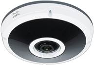

# Motion Eye 

## DIY Security camera software

See [motioneye install for ubuntu](https://github.com/ccrisan/motioneye/wiki/Install-On-Ubuntu) for more info.

Install is on these two containers:

* [motioneye](http://10.0.40.21:8765)
* [motioneye 2](http://10.0.40.22:8765)

## On c220

Create the container as `provisioner` user on 10.0.40.50:

```
./create.new.lxd.container.sh motioneye2 10.0.40.22 10.0.40.1 default
```

then get a root shell

```
lxc exec motioneye2 -- /bin/bash
```

And edit the `.ssh/authorized_keys` file so chen and mrjones can SSH in:

```
ssh-rsa AAAAB3NzaC1yc2EAAAADAQABAAACAQDGl8DxabTME8c540/26Z9Imr5/YfO07b9EE2bo9rLRqJdXl0mHZVPJzDXVKeJ8htoqXpEXWpbBO8dhP2yGe4Hwrfhpq+ynk7kLLcaYpXCYSRgIs1fSFjKQTr1UTC1eopjE0ubC+GxzlvM9uBtVEpIXQK7sNjgAtIBHOcGh4SDI8Ar2w9KLQ7Pl/7PoMkLPVXgByvY5WfengL5jL2WzRwSkomgYi9CtwLy32erm8xUvs+mB53hxE/dQ0vmgq+Ez+aW+i4QzZh+EB77MWMUctWzSEnRSXmeZyLt23Np9u0PaGoqFDuy7hvsGJVO6Wr3fxzSx7M+VN/IQ+QN5oEvRdrCTKT9pwZIt0ZiymUrpQdq/bS6IZBqb2gIiRtU57aU30DHhfSCEv/eJlIpiz6dXuiaT2nARb02k4NLxBxIQj4ZOMO1mlsWKsKiIdCBAmx/0ge2Ak726MIKZKGQv0yNPdW9HO1hjxlIaXskt8sFCY9YFyFgay82L1PR3wTnHevRgApBx0i4d1Vop9Kd/cYH98DKYM1ior/iu6++TpctAeBikOVgBzkTxf5miNA5Lvx70iGf+P8ABEyA9suTXhy+ZEzE647fI0aV61k9XyxwmLNqZOsGp2HmA9DCVG2876UZB5cLlw/PpJcSycuxBE07SCEfFDXsD4XSkYHyLtq/iyb7ZWw== chen@chenisa.ninja
ssh-ed25519 AAAAC3NzaC1lZDI1NTE5AAAAIGCnfjkyMl4ZaZbfJXjKtBXoggGlosHP8IT8wgnzSYz8 mrjones+synshop@plip.com
```

## Install motioneye

Ensure SSH works, you can get root and apt is up to date:

```
ssh ubuntu@10.0.40.22
sudo su -
apt-get update
apt-get upgrade
```

Now install motioneye:

```
apt-get install motion ffmpeg v4l-utils
apt-get install python-pip python-dev curl libssl-dev libcurl4-openssl-dev libjpeg-dev
pip install motioneye
mkdir -p /etc/motioneye
cp /usr/local/share/motioneye/extra/motioneye.conf.sample /etc/motioneye/motioneye.conf
mkdir -p /var/lib/motioneye
cp /usr/local/share/motioneye/extra/motioneye.systemd-unit-local /etc/systemd/system/motioneye.service
systemctl daemon-reload
systemctl enable motioneye
systemctl start motioneye
```

Update web passwords in GUI and put them in `/home/ubuntu/pass.txt`

## Configure motioneye with cameras

### Cisco 7070 Dome camera



This camera has a static IP of `10.0.40.7`.  The web gui is at [https://10.0.40.7](https://10.0.40.7).  You'll have to accept the invalid SSL cert. Username is `admin` and the password is in the keepass vault.

This is a [Power over Ethernet](https://en.wikipedia.org/wiki/Power_over_Ethernet) (PoE) camera.

To add the camera to motion eye, use the following settings:

* name: `camera1`
* camera device: `rtsp://10.0.40.7:554/StreamingSetting?version=1.0&action=getRTSPStream&userName=stream&password=xqFQqF6LnH&ChannelID=1&ChannelName=Channel1`
* camera type: `Network Camera`
* resolution: `custom`
* width: `1920`
* height: `1920`
* frame rate: `15`


### Cisco 5010 PTZ camera


This camera has a static IP of `10.0.40.8`.  The web gui is at [https://10.0.40.8](https://10.0.40.8).  You'll have to accept the invalid SSL cert. Username is `admin` and the password is in the keepass vault.

This is a PoE camera.

**Note**: The PTZ functionality doesn't seem to work. Manually position the camera so that it points to where you want it.

To add the camera to motion eye, use the following settings:

* name: `camera2`
* camera device: `rtsp://10.0.40.8/stream1`
* resolution: `1920 x 1080`
* frame rate: `15`
