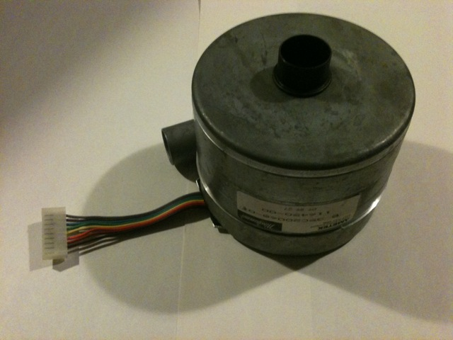
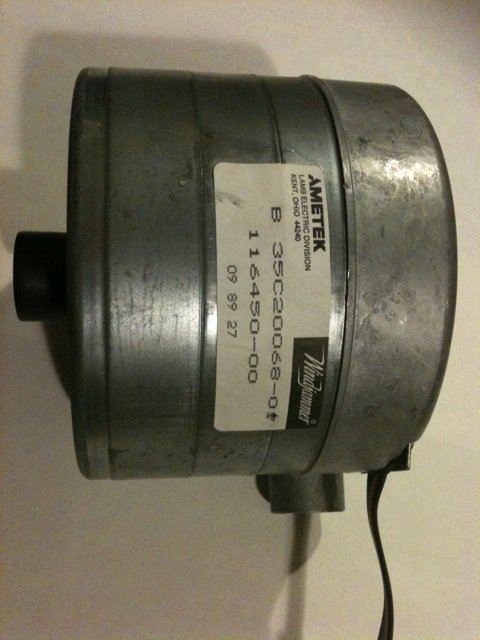
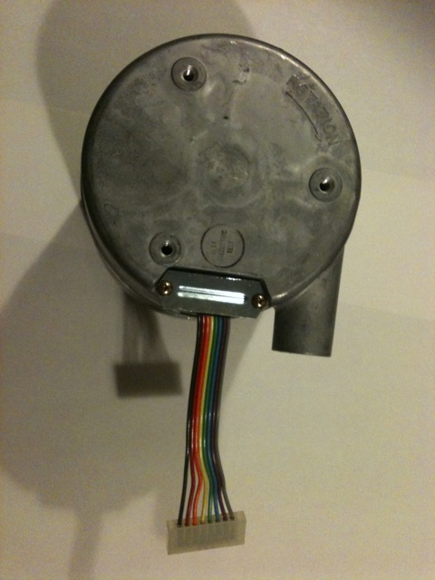

# Do-nato

"What if we created a vacuum tube that could suck up people's money?"

"Awesome!"

And that gave way to the Do-nato

## Project Goal

Create an interactive donation display that lets people place money in an intake opening and watch it get sucked in through a series of tubes and blinking lights, into a vortex of SYN Shop donations.

## Design

* Money intake to clear tubing leading to a container vessel with a vortex of money.
* Sensor on the intake which triggers the donation cycle
* Blinking lights along the tubing path 

## Resources

Several blowers were donated to SYN Shop which could possibly be used:

[116450-01 Ametek WindJamer BLDC Low-Voltage Blower](./images/48133-Ametek.pdf)  
[48133 Ametek 10-Amp BLDC Motor-Blower Controller](./images/116450-01-Ametek.pdf)  

  
  
  
