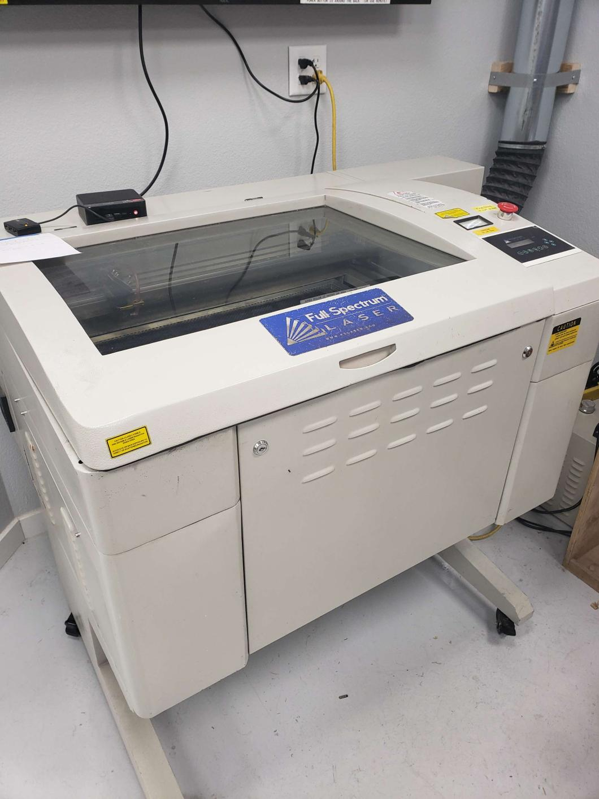
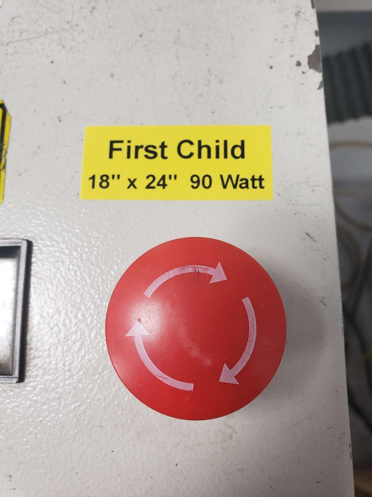

# "First Child"  Laser Cutter

   * The shop's first laser cutter, thus it is called "First Child"
   * 90 Watt Pro LF Series 24" x 18" CO2
   * Uses [Retina Engrave](/users/Equipment/Retina Engrave)
   * See also ["Big Boi"](/users/Equipment/Big Boi Laser Cutter) and ["New Kid"](/users/Equipment/New Kid Laser Cutter) laser cutters

