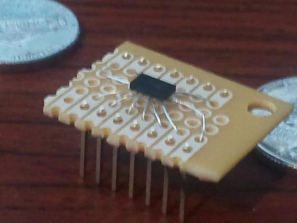
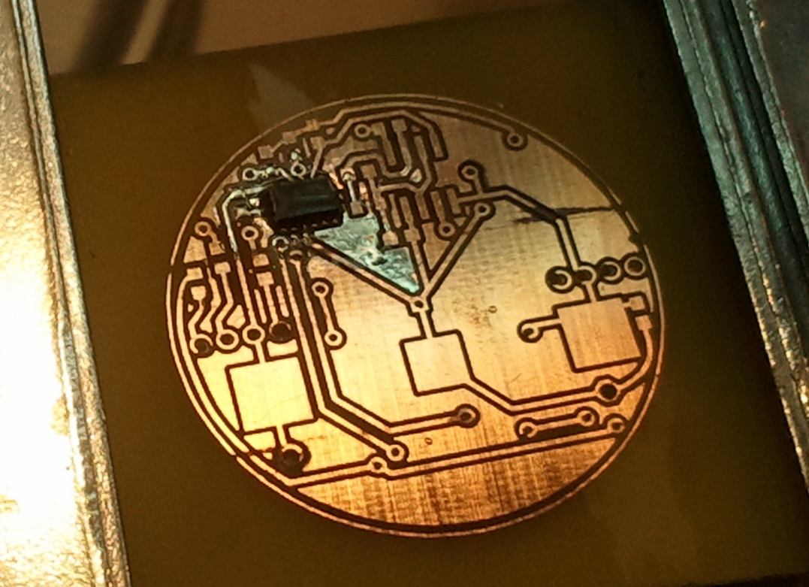

# 555 Contest - Gravity Detecting, Color Swirling Pingpong Balls

After hearing about the 555 Timer Contest(external link) being run by Chris Gammell(external link) and Jeri Ellsworth(external link) krux and I decided that we must enter it.

A few weeks prior a mutual friend had an idea for an art project that involved lit pingpong balls cycling through a fountain. We decided to take a part of this idea and run with it: lit pingpong balls. What are these good for you ask? They make great cat toys, they entertain small children, and I really want to build about 50 of them and dump them into the Bellagio Fountains here in Vegas.

Our end result was a circuit that uses 3 independent 555 timer circuits to drive a pair of RGB LEDs. A 3-axis accelerometer hooked to the control pins of each 555 vary the intensity of each color as the orientation of the device changes. The whole device is powered by a 3v coin cell battery and if the appropriate packages are used the whole thing will fit inside a pingpong ball.

Here are a couple of videos of both the prototype and the real thing in action to prove that the circuit does in fact work!

<iframe width="560" height="315" src="https://www.youtube.com/embed/7Wl7MXmlyWg" frameborder="0" allow="autoplay; encrypted-media" allowfullscreen></iframe>
<iframe width="560" height="315" src="https://www.youtube.com/embed/F93twuQmz0g" frameborder="0" allow="autoplay; encrypted-media" allowfullscreen></iframe>
<iframe width="560" height="315" src="https://www.youtube.com/embed/2QenNlfDv9g" frameborder="0" allow="autoplay; encrypted-media" allowfullscreen></iframe>

Just to show you it is all self contained.

The schematic and board layouts are available in both pdf and eagle formats at the end of this post if you want to try to build your own.

## Parts List

Qty | Part | Package | Mfg | Source | Notes
------|------|------|------|------|------
1 | [MMA7341LCT 3-axis accelerometer](http://cache.freescale.com/files/sensors/doc/data_sheet/MMA7361L.pdf) | LGA-14 | Freescale Semiconductor | [Mouser](http://www.mouser.com/ProductDetail/Freescale-Semiconductor/MMA7361LCT/?qs=sGAEpiMZZMv/PFJ6Ktv/ziiUouogt%252bJW) | These are very popular, inexpensive accelerometers. Unfortunately they only come in a leadless package without exposed pads. This makes soldering them onto prototypes a pain. Fortunatly Sparkfun(external link) sells a breakout board.
2 | 5mm Common Anode RGB LEDs | 4-pin through hole | Misc | [C-LEDs.com](http://c-leds.com/store/) | Basic RGB Leds. Since the device runs at 3v, make sure all the LEDs (especially the blue one) will light up well at 3v. The LEDs I used were purchased from c-led's ebay store.
1 | [TS555CD](http://www.st.com/stonline/books/pdf/docs/4077.pdf) | SOIC-8 | STMicroelectronics | [Mouser](http://www.mouser.com/ProductDetail/STMicroelectronics/TS555CD/?qs=sGAEpiMZZMsFq5dYAzx%252bAFeiB1Mj74zc3SuGj8txVCk%3d) | Low power surface mount 555 timer
1 | [TS556CD](http://www.st.com/stonline/books/pdf/docs/4078.pdf)  | SOIC-14 | STMicroelectronics | [Mouser](http://www.mouser.com/ProductDetail/STMicroelectronics/TS556CD/?qs=sGAEpiMZZMsFq5dYAzx%252bANQiAeQPpRvyrLsteSHtgz0%3d) | Low power 556 (dual 555 timer).
7 | .1uf Capacitors | 0603 | Misc | Misc | 
3 | Diodes | 0603 | Misc | Misc | 
2 | 47ohm resistors | 0603 | Misc | Misc | Used on the blue legs of the RGB leds | 
4 | 100ohm resistors | 0603 | Misc | Misc | Used on the red and green legs of the RGB leds | 
3 | 220ohm resistors | 0603 | Misc | Misc | 
4 | 10kohm resistors | 0603 | Misc | Misc | 
2 | 2032 coin cell battery holders | Surface Mount  | Keystone | [Mouser](http://www.mouser.com/Search/ProductDetail.aspx?R=3026virtualkey53400000virtualkey534-3026) | We used 2 batteries in parallel for longer life since we are powering 6leds, 3 timers, and an accelerometer.

Note: All resistor values were determined by experimentation using parts we already had lying around the shop.

Circuit

There are 3 identical 555 timer circuits, one for each axis of the accelerometer, wired up as astable oscillators. The outputs from the accelerometer axis are hooked directly into the control voltage.

As the accelerometer is moved the output voltage varies between ~.5 and ~2.5 volts representing -1 to +1g on each axis. This causes the duty cycle of the 555 timers to vary between ~40% and ~95%. Since the 555 is being used as a sink for the LEDs, higher duty cycle = dimmer led.

Everything is run off 2 3v coin cell batteries wired in parallel. 5v power cannot be applied to this circuit without blowing the accelerometer.

## Prototype

Like most hackers we generally prototype on a solderless breadboard. This presented a bit of a problem for this build as we did not have any of the major components in a breadboard-compatible DIP version.

Krux quickly whipped up breakout boards for the surface mount 555 and 556, but the tiny accelerometer gave us a bit more trouble. Not wanting to etch a breakout board, we flipped it over and krux soldered leads directly onto the pads, creating a dead bug breakout.

The dead bug was then mounted on a piece of perfboard and headers were added to make a
breadboard compatible package.

Most of the rest of the afternoon was filled with cursing as we tried to figure out how to make the 555 do what we were trying to do. The result was this:

The smaller breadboard holds just the accelerometer so we could test it without having to move the whole circuit around. Although the small board is an microcontroller dev board, only the solderless breadboard piece is being used. This advancement only came after an hour of frustration caused by wires and other parts flying off the main board as we tried to test.

And here is a still of it in action.

## Board

Once the prototype was working we went about designing a board that would fit inside a pingpong ball. We knew this would be a daunting task as it would need to be a double sided board with components on both sides in order to fit inside.

We were concerned that we would not be able to etch the board ourselves, specifically the tiny, closely spaced pads needed by the tiny accelerometer.

We ended up printing transparencies and using the photoresist etch method to etch one side of the board, drill alignment holes, and then expose and etch the other side. Krux said it was --the
best board he had ever made-- a pretty good board despite the microscopic flaw in one of the traces which caused a significant amount of cursing and debugging.

A note on soldering the accelerometer. Our original plan was to use solder paste and reflow the accelerometer side of the board using an electric skillet. However, due to not being able to obtain decent solder paste locally krux instead placed a bit of solder on each pad, then used a hot air rework station to reflow just the one area. This worked like a charm and you can see the results in the picture above.

The board mounted inside the pingpong ball. It finally works in the 11th hour, less than 24 hrs before the contest ends. Special thanks to PG who stayed up way past her bedtime to cheer us on and had the idea of putting tape onto the batteries where they overlapped the vias. She was also the control rod to prevent us from collapsing in a fit of rage and cursing.

We had a variety of issues building the actual board. Since the board is hand etched we had to wire the vias. This created issues as our battery holders were right over the top of a few of them. Liberally applied tape kept everything from shorting out. We also had a tiny gap in one of the traces which was causing one of the 555 timers to not get the correct amount of power. This took a lot of time to track down. Both of these can be avoided if we have the boards made for us by a PCB manufacturer.

Though this build had a lot of tricky stuff, most of it was related to cramming it into a tiny space. This is a really fun circuit to play with and can be easily built on a breadboard using dip components and a breakout board for the accelerometer.

## Downloads

* [Schematic (Eagle)](./images/555 ping pong balls - alt.sch)  | Full schematic for use with eagle
* [Schematic (PDF)](555pingpongballs-sch.pdf)  | Same schematic, but in pdf form
* [Board (Eagle)](555 ping pong balls - alt.brd)  | Board layout file for eagle
* [Board Top (PDF)](555pingpongballs-top.pdf)  | Board top in pdf format. Printed side goes onto the board, can be used with the toner transfer method
* [Board Bottom (PDF)](555pingpongballs-bot.pdf)  | Board bottom in pdf format. Printed side goes onto the board, can be used with the toner transfer method