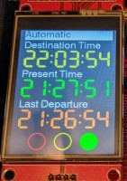

# Traffic Light

This is a re-purposed traffic light that tells if the shop is open or not:

  * Green - we're open, come on in!
  * Yellow - we're closing in 30 min or less, hurry up!
  * Red - we're closed. Please come another time!
  
## History

This originally was at the old shop in the display window when we were at 117 N 4th St, Las Vegas.  It had a manual timer that you could set for how long it should stay on.  When it first turned on it would show green and when there was 30 min left on the timer, it would turn yellow:

  

After the move to the location to 1075 American Pacific, at some point it broke.  

## Current status

As of Feb 2020, it has been revived with the power or IoT!  It now has an [ESP32 chip](https://en.wikipedia.org/wiki/ESP32) that powers a screen, web server controller and automated timer.   

  

You may have guessed where the [UI came from ;)](https://flickr.com/photos/jimroyal/4986120721). 

If you're in the shop, you can control the lights at [time-circuit.synshop.org](http://time-circuit.synshop.org). If you're not in the shop, you can see an image of the light status in the upper right of any page on [our web site](https://synshop.org/).  Further, if you just can't get enough traffic light, we have a [live image](https://synshop.org/traffic-light/status.php)  as well as [live status JSON](https://synshop.org/traffic-light/status.json), both updated every minute.

*Note* - If the traffic light crashes, you know, because IoT, then the last cached JSON file will be shown.  The traffic light image and JSON may be stale, thus wrong!! 
 
To find out more about the technical implementation, see [the admin guide](/admins/Traffic-Light/) or the [time-circuit repository on Github](https://github.com/krux702/time-circuit). 
